# Kimon — Screenshots

> A focused productivity app for Pomodoro timers, analytics, task planning, and sleep tracking.

---

## Focus Timer

Two clock styles — **Concentric Dial** and **Flip Card** — for a distraction-free 25-minute session.

<table>
  <tr>
    <td align="center">
      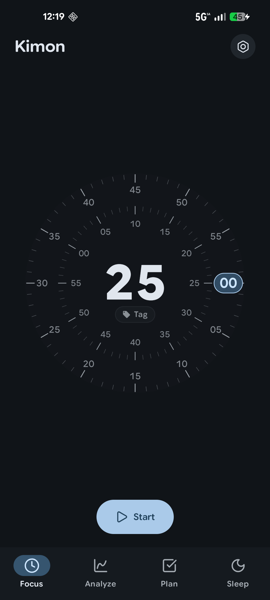 
      <b>Dial Timer · Dark</b>
    </td>
    <td align="center">
      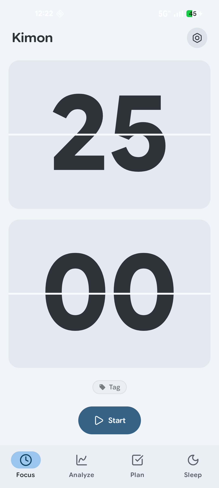 
      <b>Flip Timer · Light</b>
    </td>
  </tr>
</table>

---

## Analyze — Overview

Streaks, activity calendar, and lifetime focus stats at a glance.

<table>
  <tr>
    <td align="center">
      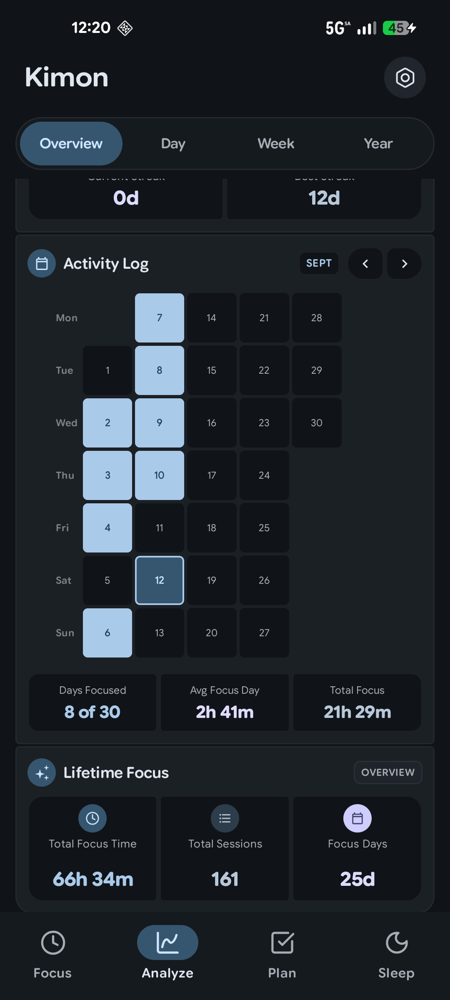 
      <b>Overview · Dark</b>
    </td>
    <td align="center">
      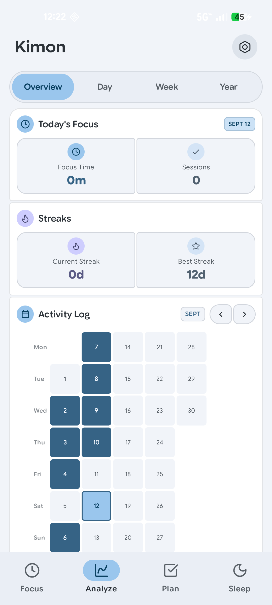 
      <b>Overview · Light</b>
    </td>
  </tr>
</table>

---

## Analyze — Day View

Hourly focus bar chart and a colour-coded timeline of every session.

<table>
  <tr>
    <td align="center">
      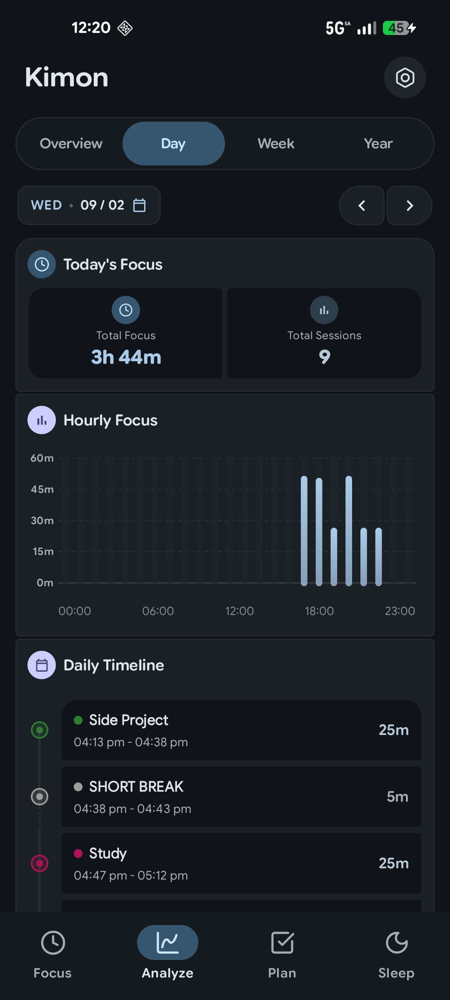 
      <b>Day View · Dark</b>
    </td>
    <td align="center">
      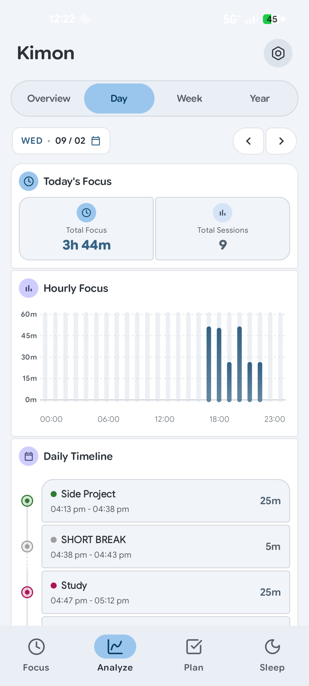 
      <b>Day View · Light</b>
    </td>
  </tr>
</table>

---

## Analyze — Week View

Weekly totals, tag distribution donut, and a smooth focus-trend line chart.

<table>
  <tr>
    <td align="center">
      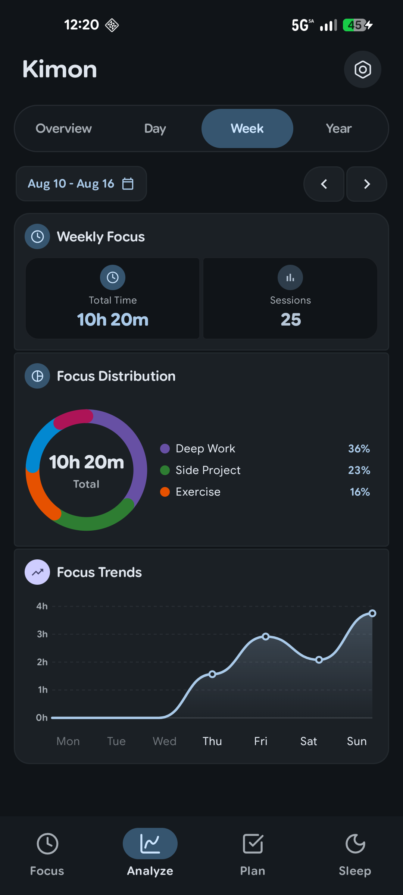 
      <b>Week View · Dark</b>
    </td>
    <td align="center">
      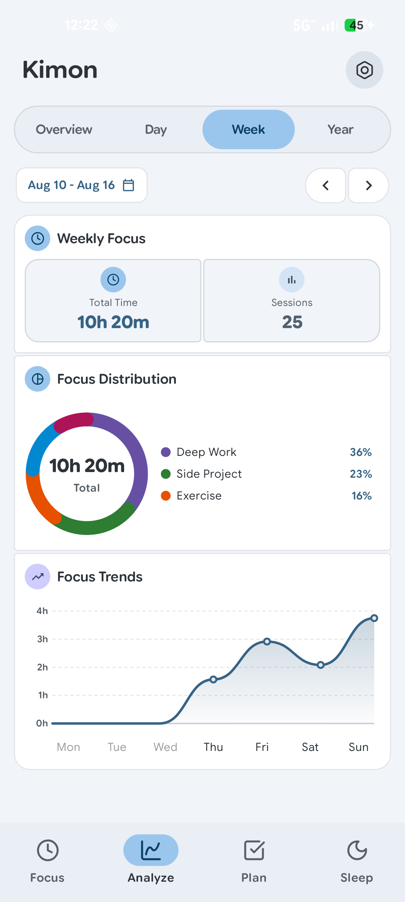 
      <b>Week View · Light</b>
    </td>
  </tr>
</table>

---

## Analyze — Year View

All-time statistics and a GitHub-style heat map of focus days.

<table>
  <tr>
    <td align="center">
      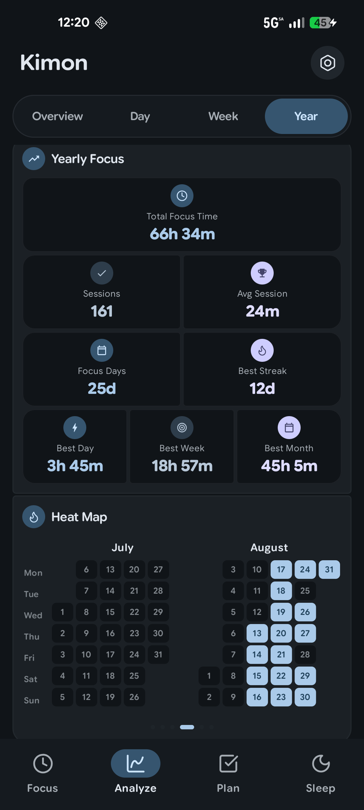 
      <b>Year View · Dark</b>
    </td>
    <td align="center">
      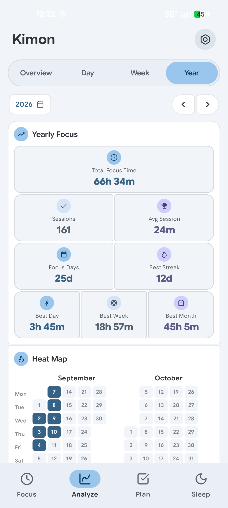 
      <b>Year View · Light</b>
    </td>
  </tr>
</table>

---

## Plan

Task list with estimated Pomodoro counts and completion tracking.

<table>
  <tr>
    <td align="center">
      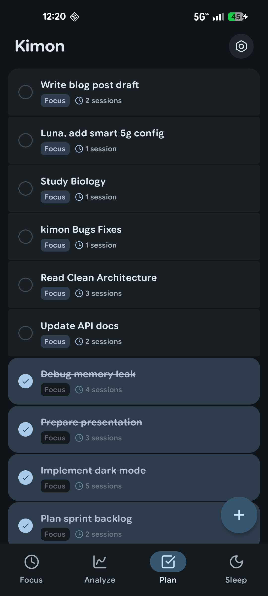 
      <b>Plan · Dark</b>
    </td>
    <td align="center">
      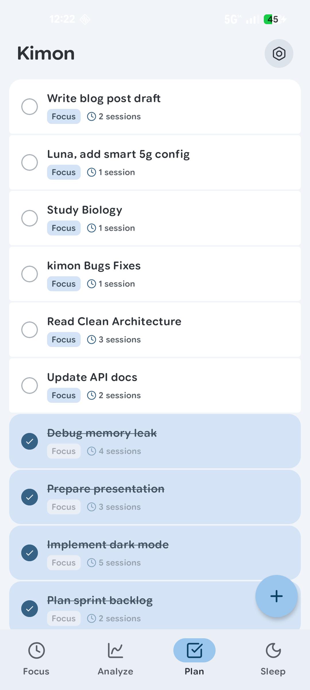 
      <b>Plan · Light</b>
    </td>
  </tr>
</table>

---

## Sleep & Daily Steps

Sleep duration, quality score, bedtime/wake-up times, and step count — all in one screen.

<table>
  <tr>
    <td align="center">
      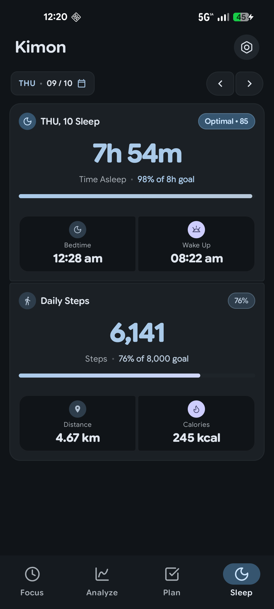 
      <b>Sleep · Dark</b>
    </td>
    <td align="center">
      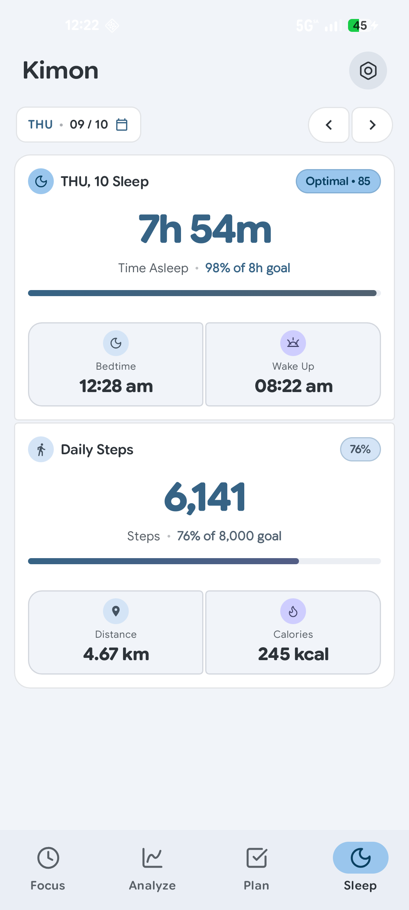 
      <b>Sleep · Light</b>
    </td>
  </tr>
</table>

---

## Settings

<table>
  <tr>
    <td align="center">
      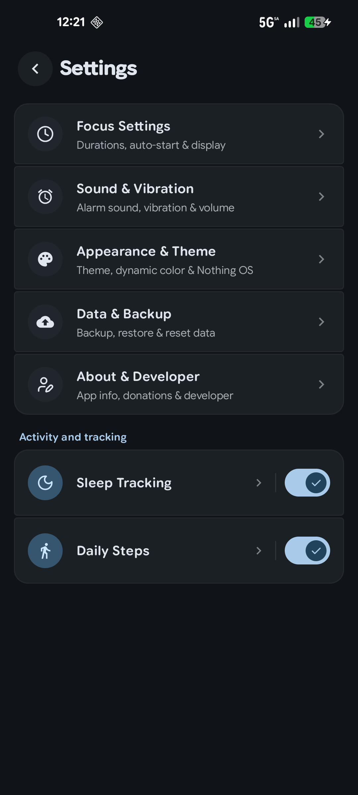 
      <b>Settings · Dark</b>
    </td>
    <td align="center">
      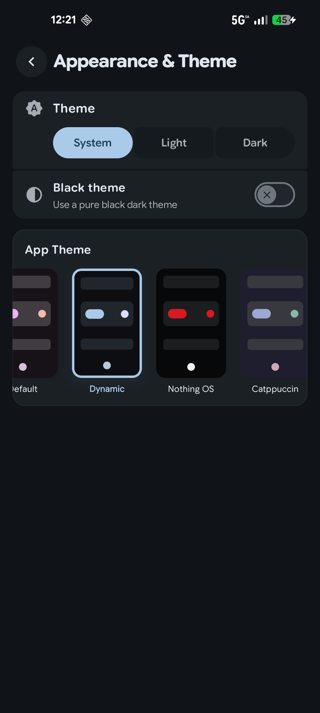 
      <b>Appearance &amp; Theme · Dark</b>
    </td>
    <td align="center">
      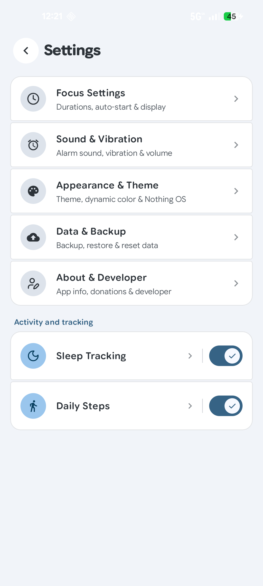 
      <b>Settings · Light</b>
    </td>
  </tr>
</table>
